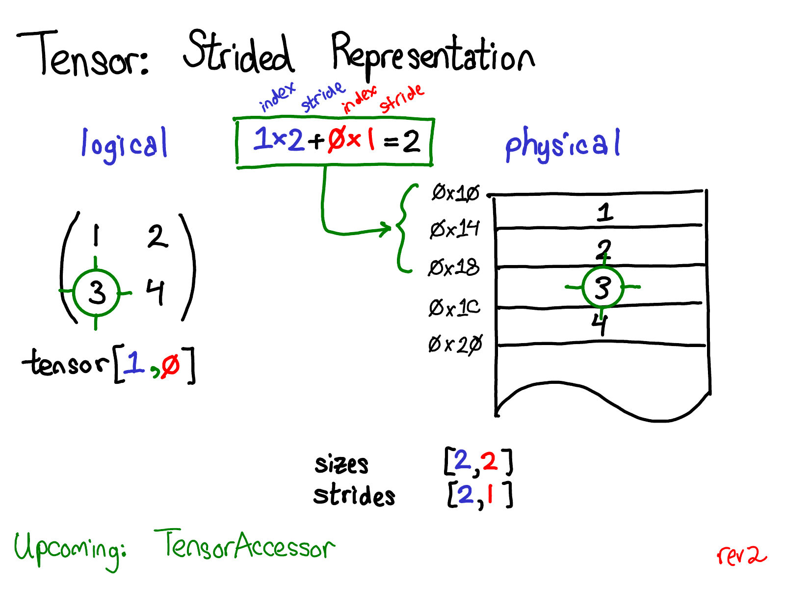

In one of the [Karpathy's videos](https://karpathy.ai/zero-to-hero.html), he recommends the blogpost by Edward Z. Yang called [PyTorch internals](http://blog.ezyang.com/2019/05/pytorch-internals/) to learn about the implementation of Tensor class in Pytorch. The blogpost is fantastic and goes into detailed representation of some of the basic functionality of Tensors.

After reading the post, I tried to implement similar functionality in [Go](https://go.dev/) using slices. In this post, I will walk through following methods of basic `Tensor` stuct:
- [NewTensor (Creating empty Tensor)](#creating-newtensor-from-data-or-empty)
- [At (indexing using arbitrary number of dimensions)](#accessing-the-single-element-with-at)
- [View (Returning different size tensor with the same underlying slice)](#viewing-the-tensor-with-different-sizes)
- [DimSlice (hardest: Getting the slice of arbitrary dimension `a[:, :, 2, :]`)](#slicing-the-tensor-along-certain-dimension)

*Full implementation code and tests can be found [this repository](https://github.com/gladuz/deep-learning-go/tree/main/tensor).*
# Tensor struct
Basic Tensor in Pytorch has the `data` in one dimensional continous array, and `sizes, strides, offset` for getting the multi-dimensional view of the Tensor.
For detailed explanation, please refer to [PyTorch internals](http://blog.ezyang.com/2019/05/pytorch-internals/).


```go
type Tensor struct {
	Sizes   []int
	Strides []int
	Offset  int
	Data    []float64
}
```
## Creating NewTensor from data or empty
```go
func NewTensor(data []float64, sizes []int) *Tensor {
	t := Tensor{}
	if len(data) == 0 {
		t.Data = make([]float64, 0)
		t.Sizes = make([]int, 0)
		t.Offset = 0
		t.Strides = make([]int, 0)
		return &t
	}
	t.Data = data
	t.Sizes = sizes
	t.Offset = 0

	t.Strides = calculateStrides(sizes)
	return &t
}
```
- `Sizes` is the dimension sizes (same as `.dim` or `.size()` in Pytorch)
- `Strides` is the required stride of each dimension, meaning how many elements should we skip to get to next element. 
For example: how many elements between `a[1, 0]` and `a[2, 0]`.

To calculate the strides of Tensor given its sizes, we reverse multiply each dimension until the first one. 
```go
func calculateStrides(sizes []int) []int {
	strides := make([]int, len(sizes))
	inter_stride := 1
	for i := len(strides) - 1; i >= 0; i-- {
		strides[i] = inter_stride
		inter_stride *= sizes[i]
	}
	return strides
}
```
Lets take a tensor `a` with with sizes `[]int{3,5,4}`. 
- `a[0, 0, 0]` is in the `data[0]` position in underlying slice. 
- `a[2, 0, 0]` is in `data[40] => 2*4*5=40`. For every increase in 1st dimension we go through 20 elements.

## Accessing the single element with `.At()` and `.Set()`
To access the single element using the indexes, we multiply and sum all the indexes and strides:
```go
func (t *Tensor) At(idx ...int) float64 {
	if len(idx) != len(t.Sizes) {
		log.Fatal("Too many indices to access")
	}
	ind := 0
	for i := 0; i < len(t.Sizes); i++ {
		ind += idx[i] * t.Strides[i]
	}
	if ind >= len(t.Data) {
		log.Fatal("The index is too high")
	}
	return t.Data[t.Offset+ind]
}
```
We can create the `At()` method similar way by assigning new value to `t.Data[ind]`.

So the tensor with sizes `[3,4,5]`, `a.At(1,2,4)` translates to `data[3*1+4*2+5*4] = data[21]`.
Here is the test for this function:
```go
func TestMatrixAt(t *testing.T) {
	t.Run("many dimensional", func(t *testing.T) {
		a := NewTensor([]float64{1, 2, 3, 4, 5, 6, 7, 8}, []int{2, 2, 2})
		got := a.At(1, 0, 1)
		want := 6.0
		if got != want {
			t.Errorf("wanted %f, got %f", want, got)
		}
	})
}
```

## Viewing the tensor with different sizes
Changing the size of the tensor only involves recalculating the strides without changes the underlying data at all. The only requirement is that the number of elements of the new and old sizes should be equal.
```go
func (t *Tensor) View(idx ...int) *Tensor {
  //prod(...idx) calculate the multiplies of elements idx[0]*idx[1]...idx[n]
	if prod(idx) != len(t.Data) {
		log.Fatal("The dimensions do not match number of elements")
	}
	strides := calcualteStrides(idx)
	return &Tensor{
		Data:    t.Data,
		Sizes:   idx,
		Strides: strides,
		Offset:  0,
	}
}
```
We can test whether the returned tensor and original tensor share the same storage:
```go
func TestMatrixView(t *testing.T) {
	t.Run("test view storage", func(t *testing.T) {
		a := NewTensor([]float64{1, 2, 3, 4, 5, 6, 7, 8}, []int{2, 2, 2})
		b := a.View(4, 2)
		a.Set(12, 1, 0, 1)
		got := b.At(2, 1)
		want := 12.0
		if got != want {
			t.Errorf("wanted %f, got %f", want, got)
		}
	})
}
```

## Slicing the tensor along certain dimension
By far the most interesting implementation was slicing the tensor. In numpy-like api we can use `arr[:, 3, :]` to get the slice of the 2nd row of 3rd dimension. In this case we have to update all three `Strides, Sizes, Offset` attributes since the both size and number of elements change in the resulting tensor. 
**We should use the same underlying array without copying any elements**.
We could implement it in two steps.
1. Create new `Sizes` ignoring the slicing dimension
2. Calculate `Strides` and `Offset` for the resulting tensor
When calculating the `Strides` we should ignore the slicing dimension but the order of the strides should be the same. 
For example: tensor `a` with sizes `[2,5,6]`, if we slice `a[:, 4, :]` we will get the new tensor with `size: [2,6], stride: [60, 30]`.

```go
// Returns the view along the dimension with ind
func (t *Tensor) DimSlice(dim, ind int) *Tensor {
	newSizes := make([]int, len(t.Sizes)-1)
	for i := range len(t.Sizes) - 1 {
		newSizes[i] = t.Sizes[i]
	}
	newStrides := make([]int, len(t.Strides)-1)
	ii := 0
	for i := 0; i < len(t.Strides); i++ {
		if i != dim {
			newStrides[ii] = t.Strides[i]
			ii++
		}
	}
	newOffset := t.Strides[dim] * ind
	return &Tensor{
		Data:    t.Data,
		Sizes:   newSizes,
		Strides: newStrides,
		Offset:  newOffset,
	}
}
```

Here is the testing code for the `DimSlice` function:
```go
func TestDimSlice(t *testing.T) {
	a := NewTensor([]float64{1, 2, 3, 4, 5, 6, 7, 8}, []int{2, 2, 2})
  /*
			tensor([[[1, 2],
					[3, 4]],
          [[5,6],
          [7,8]]])
		*/
	t.Run("test getting 2 dim", func(t *testing.T) {
		b := a.DimSlice(2, 1)
		/*
			tensor([[2, 4],
					[6, 8]])
		*/
		got := b.At(1, 0)
		want := 6.0
		if got != want {
			t.Errorf("wanted %f, got %f", want, got)
		}
	})
```

I wholehardely recommend reading the original blogpost, it has much more detailed and in-depth information that is far beyond the scope of this blogpost. Thanks for reading this far :)