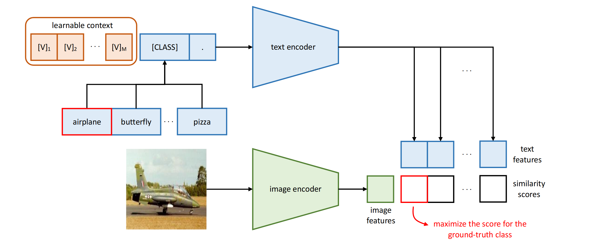

I've been trying to learn more about Vision language models (VLMs) and their efficient fine-tuning techniques. From reading several [survey papers](https://www.sciencedirect.com/science/article/pii/S0097849324000128), it seems the efficient finetuning techniques are divided into two categories: **soft prompt tuning** and **adapters**.
## Soft prompt tuning
Original [CLIP paper](https://arxiv.org/abs/2103.00020) used hand-crafted prompts to design the text embedding. General case involved having a prompt template with `a phot of [CLASS]` like structure. The problem was that the prompts didn't perform the same for all downstream tasks. Some of the more specialized or fine-grained datasets required specific prompts to achieve good performance. 

Some examples include:
- ~5% difference between `a photo of [CLASS]` and `a photo of a [CLASS]` in Caltech101 dataset.
- ~13% difference `a photo of [CLASS]` and  `a sattelite photo of [CLASS]` in EuroSAT dataset.
Finding the best prompt for each downstream dataset can be difficult. Also, words in the prompt are discrete and finite. This means the prompt space is confined to the embeddings of the vocabulary. 

### Enter learnable prompts
What if we can find the best prompts using the data itself? [Zhou et al.](https://arxiv.org/abs/2109.01134) proposed the extremely simple adaptation technique ***Co**ntext **Op**timization*. 
Instead of using the selected words for the context, we initialize the prompt with $M$ random vectors with the same dimensions as word embeddings. 

During the finetuning process, we freeze the pretrained model and only update the learnable context vectors using backpropogation. This results in optimized context vector prompts that is specific to the dataset we are finetuning on.
This can be seen as automatically searching for the best prompts, but instead of using words as search space, we are searching the vectors in the embedding space itself.

